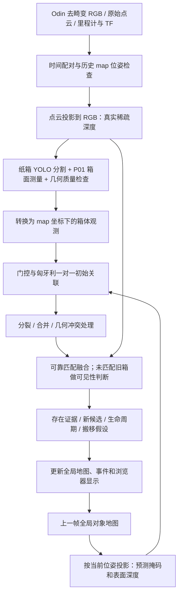

# Odin 主动感知项目：当前算法与实现状态

更新日期：2026-09-12。本文总结当前工作区代码，不是后续方案，也不代表全部实机验收通过。参数为代码默认值，运行时以前端配置和结果文件中的实际参数为准。

本次已接入前后排独立身份、实测表面清空判断、明确的视野状态、策略全量/增量输出、可选批次观察和事务提交。已按用户纠正撤掉外围背景点和其他箱面稳定性的门槛；它们不能决定目标箱的去留。测距异常本身仍未解决；参见第 14 节的验证和限制。

## 1. 当前任务和边界

当前实现是主动感知项目的基础部分：**给定相机视角或运动轨迹下的纸箱跨帧持久感知与全局对象地图**。

目标是让同一个纸箱在多帧、多视角观测中保持同一 `global_id`，让新箱进入地图，并区分漏检、遮挡、原位置清空、分割分裂、分割合并和可能搬移。检测结果只是观测，不能直接决定全局身份；没检测到也不等于箱子消失。

当前约束：

- 使用原纸箱分割模型 `assets/box_seg.pt`，复用 `get_box_node` 的 P01 识别和箱面测量算法，不调用其服务接口。
- 使用 Odin 提供的 SLAM 定位，不另外运行一套 SLAM。
- 支持实时计算、手动单帧和手动稳定观察一批；浏览器统一显示图像、点云、全局箱体、策略集合、记录和诊断。
- 暂不执行主动探索、下一最佳视角（NBV）选择、云台轨迹规划、机器人运动和抓取。
- 药箱抓槽精定位、D405 手眼近拍不属于当前测试算法。

设计依据：[原始持久箱体地图规格](/home/nvidia/odin_nx_persistent_box_mapping_spec.md)。以下以实际实现为准；与规格的差异见第 12 节。

## 2. 总体流程



一次计算包含“当前检测”和“旧地图在当前视角下应该看到什么”两条信息。全局管理的核心是后者；只做逐帧 YOLO 或按图像位置排序，无法维护全局身份。

## 3. 输入、同步与坐标

### 3.1 数据来源

| 输入 | 当前用途 |
| --- | --- |
| `/odin1/image/undistorted` | 去畸变 RGB，当前分辨率 1600 × 1296，供分割和可视化 |
| `/odin1/cloud_raw` | 原始测量点云，投影生成与 RGB 对齐的稀疏深度 |
| `/odin1/odometry` | 时间匹配检查；不在本模块自行积分构造全局坐标 |
| `/tf`、`/tf_static` | 获取图像时间戳对应的 `map ← cloud_frame` 变换 |
| `runtime/odin1/calibration/calib.yaml` | 相机内参及 LiDAR 到相机的外参 `Tcl_0` |

当前持久感知进程不订阅厂家深度图，而是在内存中从 `cloud_raw` 生成深度。客服录包中的 `/odin1/diagnostics/depth_registered` 是我们额外发布的派生深度话题，不是 Odin 原生深度输出。IMU 由设备定位链路使用，mapper 不直接融合 IMU。

### 3.2 时间和位姿要求

从缓存中选择能够配齐点云和历史 TF 的近期图像：RGB—点云时间差不超过 20 ms。位姿使用图像时间戳查询，禁止用“最新 TF”替代历史位姿，也不把 odom 冒充 map。独立 Odin 里程计消息的到达时差仅用于诊断，不再否决已经取得的精确时间 TF；输出 `rgb_odom_dt_ms` 与 `pose_source=RGB_TIMESTAMP_TF` 区分两者。

TF 未就绪时等待，不消费待处理图像或手动计算请求。TF 接收使用独立 ROS 节点/执行线程，避免检测计算阻塞接收。

当前没有对点云做逐点运动去畸变。原始点的 `offset_time` 表明一帧可能覆盖约 95 ms，因此消息头对齐不能证明每个点与 RGB 同时采样；移动相机时仍需验证这一误差。

### 3.3 坐标变换和深度定义

约定 `T_A_B` 将 B 系中的点变换到 A 系：

```text
p_camera_optical = Tcl × p_lidar
T_map_camera    = T_map_lidar × inverse(Tcl)
p_map           = T_map_camera × p_camera_optical
```

相机 optical 坐标为右、下、前；原 P01 测量函数的 project-camera 坐标为前、左、上。因此测量输出的中心、旋转、法向和角点统一转换一次：

```text
(x_optical, y_optical, z_optical) = (-y_project, -z_project, x_project)
```

深度投影使用 `u = fx·X/Z + cx`、`v = fy·Y/Z + cy`，保留相机 Z 在 0.20～8.0 m 内的点。同像素取最近 Z；无实测返回的像素为 NaN，不插值、不补洞。这里的 Z 是光轴深度，不是原始点的欧氏距离 `sqrt(x²+y²+z²)`。当前 mapper 使用上述针孔公式，未纳入标定矩阵的小 skew 项；后续精度核验应包含这一差异。

**箱体记录的 XYZ 是 map 坐标下的可见前表面中心，不是整个箱子的体积中心。**

浏览器加载了保存地图，只表示背景地图可显示，不表示实时 `map` TF 已定位成功。显示的保存地图必须与 Odin 重定位使用的地图一致。

## 4. 单帧纸箱识别和姿态测量

### 4.1 复用的 P01 流程

1. YOLO 实例分割。置信度下限为 0.70；前端可以调高，不能降低生产门槛。默认推理尺寸 640，默认设备为 GPU 0。
2. 使用 `retina_masks=True` 获取原图坐标下的掩码，检查掩码尺寸，避免将带 letterbox 补边的掩码直接拉伸到原图。
3. 调用生产 `_split_far_merged_instances(Operation.P01, ...)`，处理单帧远拍粘连分割。
4. 掩码内缩 5 × 5 像素后做真实深度统计，以中位数和 MAD 抑制离群点，减少箱边、接缝的污染。
5. 检查投影物理尺寸，再调用生产 `visible_measurement`。输入包括局部 RGB/深度、修正后的 ROI 内参、邻箱边缘和尺寸先验。
6. 使用安全中心区域的平面拟合、角点射线与平面求交、轮廓修正等 P01 测量步骤，得到前表面中心、可见宽高和完整姿态。
7. 将结果转换到 map 坐标，再经过新增的几何质量检查，决定是否允许新建或更新对象。

这里复用了识别和定位函数，但整个 Odin 适配、质量保护、跨帧持久地图不是原 `get_box_node` 的完整运行接口或行为。

### 4.2 接受条件

| 检查 | 当前默认值 |
| --- | --- |
| 投影宽度 / 高度 | 0.30～0.75 m / 0.25～0.58 m |
| 投影宽高比 | 0.65～1.90 |
| P01 测量状态 | `measured_visible_face`，且质量不是 `partial` |
| 可见面两条边 | 均不小于 0.35 m，均不大于 0.80 m |
| 真实有效深度点数 | 至少 80 |
| 深度空间覆盖率 | 至少 0.40，采用 8 px 采样格 |
| 独立诊断平面内点率 | 至少 0.50，RANSAC 残差门槛 0.025 m |
| 位置关联的中心区域内点率 | 至少 0.50，并同时满足真实点数、空间覆盖、残差和法向交叉检查 |
| 实际输出姿态的中心区域内点率 | 至少 0.70；不足时不采用本次姿态，不再单凭此项否定位置记录 |
| 实际输出平面的 RMSE | 不超过 0.02 m |
| 输出法向与独立支撑平面法向夹角 | 不超过 12° |

Odin 深度是稀疏投影。“40% 覆盖率”指掩码采样格中有真实返回的格子比例，不是要求 40% 的 RGB 像素都有深度。点数、空间覆盖率和平面质量分别检查；不能通过补洞制造有效点。

独立 RANSAC 用于诊断和交叉检查，不直接替代 P01 输出姿态。位置证据不合格的观测不能创建或移动全局对象；位置通过、姿态未通过时可维持位置和身份，但不更新姿态与尺寸。部分 P01 拒绝片段可作为 `conflict_only` 证据解释分裂/合并。

### 4.3 姿态、尺寸和先验

`normal_world` 表示前表面朝向相机一侧的外法向，`horizontal_world` 表示箱面水平轴。使用 map 的 +Z 方向构造相机中的上方向，因而依赖 map 与重力方向的一致性；没有强行令所有箱面的法向平行。

测量函数有约 0.40 × 0.40 m 的箱面尺寸先验及条件回退，结果中保留 `size_prior_fallback` 标记。三维箱体的前表面宽高来自测量，**不可见的厚度固定采用 0.30 m 先验**。后表面由前表面沿负法向延伸，因此显示的立方体不等于完整测量过六个面的真实箱体。这一先验也会影响侧视投影和遮挡判断。

## 5. 全局对象表示与关联

### 5.1 地图中保存什么

每个对象保存：`global_id`、生命周期状态、是否曾确认、map 前表面中心、法向、水平轴、宽高厚度、协方差、累计观测次数、正负存在证据、时间戳、近期事件和创建时的几何锚点。八个箱体顶点由这些几何量构造。另存实测表面及质量来源；当前每次可靠匹配更新该前表面，还没有完成同一箱子多个面的自动身份合并。

对象 ID 在当前会话中递增；图像中的帧内检测序号不等于全局 ID。`VACATED` 对象退出当前地图，但保留历史。

### 5.2 旧地图投影到当前帧

将每个非 `VACATED` 箱体从 map 变换到当前相机坐标，把六个面拆为十二个三角形，以透视正确的深度缓冲栅格化，得到预测掩码和逐像素预测表面深度。

清空判断另行投影可信实测表面，要求相机位于该面的正面、投影不少于 300 像素且不触及 5 px 边界。`OUT_OF_FOV`、`PARTIAL_FOV`、近裁剪面、未测量方向、尺寸先验回退等均不能产生清空证据。完整 cuboid 继续用于显示和关联的粗预测。

所有旧箱还会生成联合深度缓冲，输出预测可见比例。该比例是辅助诊断，不能否决真实射线的清空证据，避免过期前排记录持续“遮挡”后排、互相阻止退场。

### 5.3 一对一关联

旧箱和当前观测必须先通过以下门控：

- 几何质量合格，且不是仅用于冲突解释的观测。
- map 前表面中心距离 ≤ 0.20 m。
- 预测掩码与检测掩码 IoU ≥ 0.05，或者交集占较小掩码比例 ≥ 0.15。
- 重叠区域至少 10 个有效深度点，实测深度与预测表面深度的绝对残差中位数 ≤ 0.12 m。

通过门控后，默认代价为：

```text
C = 0.30 × (中心距离 / 0.20 m)
  + 0.30 × (1 - mask IoU)
  + 0.25 × min(深度残差 / 0.12 m, 1)
  + 0.15 × 平均相对尺寸差（各维截断到 1）
```

使用匈牙利算法形成初始一对一分配，仅保留代价 ≤ 0.55 的配对。**此时尚未融合**，还要先解决分裂、合并和几何冲突。

完整几何可靠匹配后直接采用当前测量，法向归一化、水平轴重新正交化；不向旧记录平滑靠拢。仅位置通过时，只更新中心，历史姿态明确标为沿用，不能冒充本次测得。位置协方差仍统计相邻测量残差，目前不是完整的 SE(3) 概率估计。

## 6. 分裂、合并与异常几何保护

2026-09-12 后续修正：DETECTOR_MERGE 必须对应多个具有独立图像区域的历史预测，每个预测至少有 20% 不被其他预测覆盖；同一箱面的重复历史估计不算检测合并。已成立的一对一关联不会被另一条陈旧历史投影否决。新建前另检查历史投影对当前检测的覆盖（至少 60%，且 IoU 至少 0.30），避免历史尺寸/姿态偏差导致 IoU 低于旧阈值时重复建号；这是暂缓身份创建，不改变当前测量质量。没有按固定“四个箱子”数量做截断。

当 P01 返回了候选但定位质量未通过，而它与唯一已确认记录的中心距离、投影 IoU（至少 0.55）、实测深度残差及有效点数（至少 80）都通过时，返回 `MATCHED_VISIBILITY_ONLY`：只确认“该箱仍被看见”，保留编号与上次几何，`last_evidence=DETECTION_PRESENT`、`visibility_state=VISIBLE`。本次测量质量仍为不合格，策略 `geometry_usable=false`，界面显示“已看见 · 保留上次定位”。关联歧义、深度不对应或支撑不足时仍不强行标为可见。

连续重新关联：只有单帧门控仅因深度残差失败、中心仍在 0.20 m 内、唯一对应 IoU ≥ 0.75、至少 80 个共享深度点、残差小于 0.18 m、实测面可信且宽高变化不超过 20% 时，才允许累计三次连续位置/法向稳定观测后沿用旧编号。竞争检测、漏检或无效定位会打断支持；超过前后层阈值不会走这个分支。它是有条件的身份恢复启发式，不改变测量质量，也不能用于强行合并真实搬移或前后层替换。

根据实际搬移后放回的测试，新增退场位置返回：对曾确认、正常退场且未被标记为重复/搬移别名的历史记录，当前测量若在 0.20 m 内、尺寸差不超过 20%、前表面 IoU ≥ 0.75、有至少 80 个对应点、深度残差小于 0.18 m，且没有邻近活跃身份占用，经三次连续稳定观测后恢复原位置编号。首两帧标记 `RETURN_LOCATION_PENDING`，不分配额外新号。恢复事件为 `OBJECT_RETURNED_TO_LOCATION`，开启新的存在证据段。

这扩展了初版“退场后不再参与关联”的规则。几何返回标记 `identity_basis=KNOWN_LOCATION_RETURN`、`physical_identity_verified=false`，不宣称能分清外观/尺寸相同的替换箱。不能因为一个箱子被放回的前箱遮住，就把它当作已移走或与前箱合并。此前把后排 7 号误认为前排 1 号的搬移位置，属于错误解释，已撤销该身份归并；前后排分别管理。

只对已退场记录的原位置进行三次观测的返回确认，不在多个前后位置之间自动合并身份。前箱移走后露出的后箱拥有独立编号；前箱放回后恢复原位置编号，后箱保留自己的编号并转为遮挡。再次移走前箱时复用后箱已有编号。几何返回仍不等同于对外观相同箱子的物理身份识别。

旧箱退场与后箱建号分开判断。旧箱优先使用自己的历史实测表面；没有可信实测边界但已有合格定位时，使用明确标注的已定位箱面估计范围，不能因精确姿态不合格永远免于退场。后箱使用自己的当前实测平面与分割轮廓。外围背景点数、背景比例、邻箱稳定性均不参与，也不要求后箱后面再露出第三层表面。旧箱的清空不能用先验厚度或地图点云替代；新箱质量不足不能自动冻结旧箱已有的有效清空证据。

先处理同帧冗余观测：若多个旧箱已有可靠独立匹配，而额外大框又覆盖这些独立框，则把大框标为 `REDUNDANT_MERGE_OBSERVATION`，优先保留独立匹配，禁止大框抢走旧 ID。新建阶段再检查已匹配/保护箱面的中心和投影重合，防止剩余独立观测另建重复身份；同帧初次检测的高度重合重复框也只建立一条候选。

| 情况 | 判据概要 | 当前处理 |
| --- | --- | --- |
| 分裂：一个旧箱对应多个检测片段 | 每个片段与旧箱投影有充分覆盖；联合掩码 IoU ≥ 0.60；深度差 ≤ 0.05 m，位置和射线残差通过检查 | 多片段沿用旧 ID，增加 0.30 正证据，不更新几何，不建立多个新箱 |
| 合并：一个检测掩码覆盖多个旧箱 | 对各旧箱预测覆盖 ≥ 0.30，深度吻合，联合预测与检测 IoU ≥ 0.60 | 保留各旧 ID，不合并全局身份，不融合几何，也不给旧箱清空负证据 |
| 编号不确定：投影很像旧箱但关联未成立 | 与最佳重叠旧箱 IoU ≥ 0.55，且初始配对失败 | 本帧质量通过时标记 `IDENTITY_PENDING`，独立输出当前测量，保留历史编号待关联 |

已撤销创建位置/法向锚点的 0.06 m / 12° 硬否决。历史记录不得用于判定当前测量质量。旧配置键 `geometry_anchor_distance_m` 仅剩重复观测消歧用途，`geometry_anchor_angle_deg` 仅剩替换与批次样本一致性用途；旧 `center_alpha/normal_alpha/size_alpha` 保留兼容但不再用于几何融合。

编号待关联的实际含义是：暂缓新建 ID，不覆盖身份不确定的旧记录；本帧有效测量仍在独立话题和前端以 D 编号显示。D 编号仅在本帧有效，不能作为全局身份。它不再自动把旧箱自身投影的 CLEAR 改成 UNKNOWN。当前 RGB/点云本身不合格时，仍由 P01/实测质量检查说明具体原因。

前后排替换的关联解除只检查目标表面：旧实测面满足 CLEAR，新表面沿对应射线至少更深 0.18 m，至少 80 个共享有效点，新平面与对应深度残差中位数不超过 0.04 m。当前新箱的位置与法向质量需通过；先验宽高不单独否决实测面。新箱法向不要求与旧箱相同。

关联解除须连续获得 3 次支持，新候选中心差不超过 0.05 m、连续样本法向差不超过 12°、支持间隔不超过 10 s；重新匹配旧箱会清除候选。满足后输出 `LAYER_REVEALED`，新观测建立独立候选或匹配已有后排 ID。等待期间输出 `REPLACEMENT_PENDING`，旧箱有效 CLEAR 仍独立累计。若旧箱已经正常退场，后续新观测按常规候选流程建立记录。

箱子自身的矛盾仍冻结该旧箱：旧面投影与当前轮廓 IoU ≥ 0.90，但该面深度突然变化至少 0.18 m；或当前所报新平面与自身对应深度不一致。这些标记为具体的 `same_outline_depth_conflict` / `new_plane_ray_mismatch`，不使用外围背景。仅靠这些观测不能保证识别所有系统性测距偏差，不能再宣称“持续整体偏移一定被拦截”。

这是身份管理上的保守处理，不能保证所有重复都能消除：它依赖较高的预测重合度，只选择最佳重叠候选；大位姿误差、低重合度、错误历史记录仍可能造成关联问题。同一投影位置发生真实替换时，也可能暂缓身份裁决；当前测量质量及原始测距精度须独立核验。

## 7. 未检测到的旧箱：保留、遮挡还是移除

对没有可靠匹配、也没有被冲突保护的旧箱，优先使用其全局可信实测表面在当前相机中的预测。深度只负责检验预测表面对应的射线上实际出现了什么，全局身份和历史仍由 map 对象维护。

12 号暴露了旧实现的生命周期漏洞：允许定位通过但姿态/尺寸边界未通过的记录确认，却又永久禁止它参加清空检查。已取消这一永久否决。没有可信实测面时，只要记录曾有合格位置观测，就对存储的箱面估计范围进行存在性预测，标记 `POSITION_CONFIRMED_ESTIMATED_FACE`；有可信实测面时仍优先使用实测面，标记 `MEASURED_FRONT_FACE`。估计范围可能含先验宽高，必须明确区别于实测边界，不升级 `orientation_trusted`、`measured_surfaces.trusted` 或策略 `geometry_usable`。候选记录也有相同退场路径，不能因尚未确认而永久滞留。

这条修正使用估计范围，准确性受历史定位和边界估计误差影响，不宣称恢复了丢失的原始测量。预测背面、视野外、边缘截断、定位或有效深度不足仍不直接判为空，仍须连续清空和存在概率条件。没有可信实测面且没有历史合格位置的记录继续待核验，不伪造历史观测。

预测掩码内缩后，需要至少 80 个真实点、至少 40% 采样格覆盖。对每个有效点计算 `r = 当前实测 Z - 预测表面 Z`：

| 证据 | 默认判定 | 对全局记录的影响 |
| --- | --- | --- |
| `GEOMETRY_PRESENT` | `|r| ≤ 0.04 m` 的比例 ≥ 0.55 | 箱面几何仍在，解释为检测漏检；正证据 +0.30，不更新几何 |
| `OCCLUDED` | `r < -0.04 m` 的比例 ≥ 0.50 | 射线先碰到更近物体，解释为遮挡；保留记录，不增减存在证据 |
| `CLEAR` | `r > 0.04 m` 的比例 ≥ 0.55 | 射线看到了原表面之后，增加清空负证据 1.50 |
| `UNKNOWN` | 点不足、边缘/视野问题、证据混杂等 | 暂不裁决，不增减存在证据 |

没有深度、离开视野、被遮挡或 YOLO 单帧漏检，都不能直接触发删除。另一方面，持续出现可靠 `CLEAR` 才能让已经搬走的箱子退出当前地图。

## 8. 存在概率和生命周期

存在概率采用带先验的证据比值：

```text
P(exists) = (1 + e_positive) / (2 + e_positive + e_negative)
```

每次加入证据之前，把已有正负证据按同一比例缩放，使历史总权重不超过 12，再加本次权重；因此本次加入后总量可以暂时超过 12。累计观测次数和事件不随此缩放。这个有界记忆防止“看了很久的箱子需要无限多次清空证据才能退出”。

| 状态 | 进入条件或含义 |
| --- | --- |
| `TENTATIVE` | 合格但未关联的观测建立候选；首次观测立即有候选 ID |
| `CONFIRMED` | 单帧模式：在匹配/分裂证据下，累计观测次数 ≥ 3 且存在概率 ≥ 0.70；批次模式另可凭至少 2 个几何一致的支持帧确认 |
| `MISSING_CANDIDATE` | 清空计数达到 2，暂时怀疑原位置已空 |
| `VACATED` | 清空计数 ≥ 4，且存在概率 < 0.25；退出当前地图，保留历史 |

匹配增加 1.00 正证据并清零清空计数；几何存在和遮挡也清零该计数。2026-09-12 起 `UNKNOWN` 同样打断清空计数，但不改变存在概率；它不再连接相隔很久的旧清空证据。分割/几何冲突也会打断清空计数。单帧模式确认仍使用累计观测数，不要求连续命中三帧。

四次 `CLEAR` 只是移除的最低计数要求，不保证当时概率已经低于 0.25。已积累较多正证据的对象需要更多清空证据。`OCCLUDED` 是可见性状态，不是对象已经退出地图。

结果中的 `map` 含所有非 `VACATED` 对象，包括候选和待移除对象；`map_history` 包含所有记录，也包括仍在当前地图中的对象。因此“历史数量”不能直接当成“已移走箱子的数量”，箱体记录数也不一定等于确认箱数。

策略输出 `active_box_map` 使用 `ever_confirmed && state != VACATED`，排除从未确认的候选，保留待移除、视野外和被遮挡的旧箱。集合是否包含该对象，与当前是否可见、几何是否可用于后续计算分开表达，不能把集合直接当作可抓取目标列表。

## 9. 可能搬移与位姿异常

### 9.1 搬移假设

对曾确认、现在为 `MISSING_CANDIDATE` 或 `VACATED` 的旧箱，与本帧观测到的新候选比较：新候选创建时间相对旧箱最后看见时间在 0～3 s 内，位置距离不超过 1 m。

按尺寸相似、时间接近、空间接近和 motion 项加权评分，权重分别为 0.35、0.20、0.20、0.15，并按权重总和归一化。当前 motion 项固定为 1，没有真实运动模型，也没有外观/SKU embedding。

评分 ≥ 0.60 建立假设，获得至少 2 帧支持后输出 `POSSIBLE_RELOCATION`；评分 ≥ 0.80 且支持数达标时标记 likely。字段虽然叫 probability，但目前是启发式评分，不是经过标定的概率。

系统只报告旧箱与新候选的可能关系，不自动复活 `VACATED` ID，也不直接合并两条历史。此前对重复 ID 的人工审计修复是一次维护操作，不属于这里的自动算法。

### 9.2 位姿异常保护

时间戳不单调、同步不合格或位姿非有限值时，不提交该次地图更新。相邻接受帧间隔为 Δt 时，以下任一条件触发位姿异常锁存：

```text
平移变化 > 0.03 m + 1.0 m/s × Δt
旋转变化 > 3° + 120°/s × Δt
```

锁存后不会因为下一帧“看起来正常”就自动继续写地图，需要检查定位并显式重置。该门槛只是异常跳变保护，不是定位精度保证，也不能检出所有缓慢漂移。

## 10. 运行方式、可视化与输出

从项目根目录启动：

```bash
cd /home/nvidia/perception_domain_nx
./src/robot_perception/scripts/diagnostics/run_odin_perception_dashboard.sh --autostart
```

本机浏览器访问 `http://127.0.0.1:8765`。`--autostart` 启动预览工作进程，点击“开始”后启用检测。此处仅提供命令，编写本文没有启动相机或程序。

| 操作 / 显示 | 行为 |
| --- | --- |
| 实时模式 | 启用后按实际处理能力持续计算，不保证固定频率 |
| 手动模式 | 空格或单次计算按钮提交一次请求；输入框内空格不触发 |
| 稳定观察一批 | 选择该模式后按空格/单次按钮，默认收集 3 组新 RGB/点云/TF，完成后只提交一次；不是点击开始就自动连续采批 |
| 暂停 | 保留对象会话，暂停检测和地图更新，继续预览 |
| 停止、重新启动 | 结束工作进程，普通重新启动建立新的编号会话 |
| 重置 | 显式清空对象会话和位姿异常锁存，不删除保存的 Odin 环境地图 |
| RGB 与检测图 | 原始预览、检测结果、全局 ID、候选身份和拒绝诊断 |
| 三维地图 | 保存的全局环境点云、实时点云、全局箱体及编号，支持查看全图和聚焦箱体 |
| 记录与诊断 | map 坐标、状态、存在证据、姿态质量、同步信息、关联拒绝原因、事件和搬移假设 |
| 策略地图 | 完整已知箱体集合与最近新增/移除/更新/保留；勾选“仅策略集合”可在三维地图及表格中过滤候选/已移除记录 |
| 保存快照 | 保存当时图像、点云、参数和对象状态，不等于录制 rosbag |

图像中的 `D0` 是帧内检测序号，`#0` 才是全局箱号。蓝色预测轮廓来自旧地图投影，不代表新检测；其形状会受旧几何和当前位姿影响。红色在不同叠加层可表示清空、退场或拒绝等状态，应以对应文字和证据字段判断，不能仅凭颜色认定新箱或障碍物。

当前适配、检测和 mapper 位于一个诊断工作进程中，TF 接收另有辅助节点。它已经能从 Odin 构造观测并运行地图核心，但还不是生产 `CameraFrame` 管线及独立模块节点的完整接入。

ROS 输出为 `/box_map/objects`、`/box_map/events`、`/box_map/active_boxes`、`/box_map/delta`（JSON String）和 `/odin1/persistent_box_markers`（MarkerArray）。浏览器结果位于 `runtime/results/odin_browser/`，包括 `latest.json`、`persistent_map.json`、`active_boxes.json`、`map_delta.json`、`events.jsonl`、图像、实时点云和工作日志；另有按采样序号轮转的 32 槽几何取证数据。

`active_boxes` 采用 reliable/transient-local、深度 1 的完整快照，含地图文件 SHA-256 标识、会话标识、版本、时间、定位有效性和对象字段。`object_uid = session_id:global_id` 避免不同启动会话的数值 ID 碰撞，不表示已经解决跨重启物理身份恢复。姿态四元数顺序 xyzw，其三轴依次为箱面水平、箱面竖直、外法向；position 仍是前表面中心，厚度仍为先验。

`delta` 在成功提交时发布，含 `base_revision/revision` 和 `added/removed/updated/kept`。新增指首次进入策略集合，移除指退出策略集合；同一提交内四组互斥。批次未完成或失败不重复发布旧增量。消费者必须核对会话、地图、版本及时间新鲜度；丢失增量时读取全量快照重新同步，不能只依赖最新一个 delta。

已有受控 checkpoint 维护恢复能力，要求原 Odin 驱动进程身份和标定哈希一致；普通启动不自动恢复。这不能视为重启设备、重定位或更换地图后的跨会话身份持久化。

旧 `run_odin_active_perception_test.sh` 是早期前置检查脚本，不作为本文所述浏览器测试的启动入口。

## 11. 已有证据与未解决问题

以下引用 2026-09-09 的[异常调查记录](ODIN_GEOMETRY_INCIDENT_20260909.md)，不是本次重新运行的测试结果。

- 25 项地图单元测试、6 项浏览器后端测试通过。
- 一个真实异常记录共 240 组同步数据，按每四帧取一帧回放 60 帧，记录中 ID 数保持为 4，没有错误 `CLEAR`/`VACATED`。
- 在线浏览器 20 次采样中，真实编号与表格、三维标记一致。
- 含几何取证的处理耗时中位约 1.58 s，约 0.6 Hz；未达到规格建议的 5～10 Hz。这是整帧处理耗时，不是单独 YOLO 时间。

这些检查证明特定回归场景的保护有效，不等于移动相机、遮挡、堆叠、替换、搬移等全部实机场景已经验收。

对于手臂进入画面后静态箱面深度和姿态变化，已有数据在 **YOLO 和地图融合之前的原始点云** 中也发现了变化：固定原始点云采样索引的测距变化约 3.77～10.17 cm；两个稳态段的平均 map 位姿差只有约 1.6 mm、0.033°。这组证据不支持把该次主要异常归因于 YOLO 或全局 TF 漂移。

但它还不能区分光学、多径、固件测距、SDK 或设备故障，也没有独立测量真值，不能宣称已经证明硬件损坏。当前软件阻止部分异常观测污染地图，**没有恢复原始测距精度，也未达到精确抓取验收条件**。

## 12. 与原规格的差异及下一步

| 项目 | 当前实际状态 / 限制 |
| --- | --- |
| 全局对象管理、关联和冲突处理 | 已实现并有回归测试，完整实机场景仍待验收 |
| 存在概率 | 增加历史证据权重上限，区别于原规格无限累计；为退场响应所做的扩展 |
| 确认和清空计数 | 单帧确认仍用累计观测；UNKNOWN/冲突已改为打断清空计数；批次模式每批只更新一次生命周期 |
| 单帧误检 | 可以产生可见候选记录，但未满足确认条件；不能说绝不进入任何地图列表 |
| 几何与身份边界 | 已撤销创建锚点否决；当前测量独立，历史仅管理关联、存在状态和移除；不能保证传感器绝对精度 |
| 箱体完整几何 | 前表面测量、隐藏厚度先验；缺少跨面观测统一同一完整物体的充分验证 |
| 搬移识别 | 启发式假设，未接入外观特征或实际运动模型，不自动合并身份 |
| 协方差与融合 | 直接采用当前合格测量，保留位置残差统计，未实现完整概率姿态估计 |
| 地图重定位与会话 | 已有地图指纹和会话限定身份；仍缺少跨重启/坐标跳变的自动物理身份恢复与地图重锚定 |
| 性能 | 全分辨率投影/掩码处理、检测与取证仍有开销；预览与计算尚未完全解耦 |
| 生产 ROS 接口 | 诊断进程可运行，尚未完成正式 CameraFrame/机器人任务接口集成 |
| 主动决策 | NBV、主动探索、自动补看和抓取执行尚未实现，原规格本阶段也不要求 |

建议后续顺序：先用固定平面、独立距离真值和可控近处物体进出完成原始测距/标定/逐点时间核验；再量化移动视角、堆叠、替换、遮挡和真实移除的 ID 与退场指标；随后优化投影 ROI、重复掩码计算和取证/预览线程，最后完成生产接口。主动选择视角应建立在几何精度和全局身份稳定性得到验证之后。

## 13. 实现入口与辅助诊断

| 文件 | 职责 |
| --- | --- |
| [odin_persistent_box_test.py](../tools/diagnostics/odin_persistent_box_test.py) | Odin 适配、同步、稀疏深度、P01 检测测量、输出与取证 |
| [persistent_carton_map.py](../camera_unload_perception/algorithms/persistent_carton_map.py) | 全局对象、投影、关联、冲突、可见性、存在证据和搬移假设 |
| [carton_detector.py](../camera_unload_perception/algorithms/carton_detector.py) | 复用的生产箱面几何测量 |
| [camera_pipeline.py](../camera_unload_perception/ros/camera_pipeline.py) | 复用的 P01 分割拆分及相关辅助函数 |
| [odin_browser_server.py](../tools/diagnostics/odin_browser_server.py) / [浏览器前端](../../../tools/odin1/browser/app.js) | 进程控制、参数、实时图像、地图、记录与诊断界面 |
| [地图核心测试](../test/test_persistent_carton_map.py) | 合成场景回归，不代替真实物理验收 |
| [run_odin_depth_viewer.sh](../scripts/diagnostics/run_odin_depth_viewer.sh) | 独立实时深度变化观察，排除 YOLO/mapper 的影响 |
| [record_support_bag.sh](../../../tools/odin1/record_support_bag.sh) | 客服问题包：标定、QoS 配置、MCAP、IMU/里程计/点云/RGB/派生深度等 |
| [prepare_odin_bag_replay.py](../tools/diagnostics/prepare_odin_bag_replay.py) | 将录包的 RGB 与深度准备为浏览器回放素材 |

独立深度查看器和客服录包用于定位输入数据问题，不是新的识别算法；RGB/深度视频回放也不等于重新运行全部全局地图算法。

## 14. 2026-09-12 批次、事务及验证

批次观察默认参数：3 帧，至少 2 帧支持，超时 20 s，批内相机平移不超过 0.01 m、旋转不超过 2°，候选位置差不超过 0.05 m。可设置 3～8 帧；图像与点云时间戳必须各自独立且图像时间递增。这里的独立指不同采样，不能据此假定噪声在统计上独立。

每个样本先对同一份冻结旧地图进行分析，再形成一个批次结果。只有最后一帧仍检测到、且获得足够其他帧支持的观测可以新增或更新几何；最后一帧漏检的旧箱仍可由此前可靠存在证据保留。任何旧箱在同一批内同时出现可靠存在和 CLEAR，整批不提交；CLEAR 还需至少 60% 样本支持且没有遮挡证据。暂停、切换模式、改检测参数和重置会取消未完成批次。

存在证据和观测计数每批增加一次，批次确认由支持帧条件单独决定，因此首次批次确认的存在概率可能低于单帧模式 0.70 门槛。移除仍保留原有 Beta 负证据及最低清空计数要求，没有直接改成“两批必删”。替换支持计数在批次模式下也每批增加一次；需要后续观察才能完成待核验，不承诺一个批次解决全部替换。

单帧和批次均先在独立事务副本中计算；验证 ID、几何有限性、尺寸和概率后统一提交对象、事件及版本。异常不能留下半更新的几何或已消耗的新 ID。位姿异常锁存与失败诊断可更新，但对象集合和成功提交版本保持不变。批次中不保留各帧的大尺寸预测图，避免内存随采样数成倍增长。

本次验证记录：

- 本节早期验证覆盖前后排替换、视野外、背面/先验面、事务失败、批次支持/矛盾/重复时间和会话身份。原“外围背景证据不足即冻结”的测试属于已撤销规则，不能继续作为正确性要求；当前验证另见 `runtime/results/odin_reveal6_fix_20260912/`。
- 浏览器后端 7 项通过；适配层 4 项通过，验证三帧完成才提交一次、单帧仍立即提交、暂停取消未完成批次以及新会话不沿用旧增量下载。
- 浏览器离线合成测试通过模式选择、空格、策略集合过滤、保留待移除/视野外箱、桌面和手机布局；没有启动相机，截图带合成测试标记。
- 原 240 组异常数据每四帧取一帧，共 60 帧重新运行 YOLO/P01 和 mapper。全部提交，始终为 ID 0/1/2/3，未产生 CLEAR/VACATED 事件；处理耗时中位约 1.39 s，不含在线取证写盘，不能直接与旧在线耗时比较。

本次[验证记录与报告](../../../runtime/results/odin_mapper_upgrade_20260912_OSc6TJ/VERIFICATION.md)保留了回放结果和标记为合成测试的浏览器截图。

仍需扩大实机验证真实拿走前排、露出后排、旋转相机和原始测距异常并存的情形。没有外围背景或没有精确抓取姿态不再单独构成永久阻断；缺乏历史合格定位、当前箱面观测矛盾或定位失效仍会保留待核验状态。多面物体身份、生产机器人接口、设备绝对测距精度仍未完成。

## 15. 2026-09-12 在线拒绝与重复候选修正

本次在线会话第 43 帧同时出现两个独立箱框与一个覆盖两箱的大框。旧实现先保护旧箱 0/1，再将未被消费的独立观测创建为 4/3；随后一箱对应两条地图记录，持续产生 MERGE。这是顺序处理与重复建档缺陷。已加入冗余观测处理和新建前重复检查，合成回归复现并验证该路径。

同时将质量分为 `detection_quality_ok`、`position_quality_ok`、`orientation_quality_ok`。兼容字段 `geometry_quality_ok` 当前表示位置是否可参与地图关联，不能被消费者当作完整姿态可靠标志。仅位置匹配返回 `MATCHED_POSITION_ONLY`。原 70% 中心平面内点率保留为姿态门槛；位置门槛为 50%，其余点数、覆盖、平面残差、法向交叉检查、map 距离和深度关联限制继续生效。该改动改善边界抖动，不保证位置绝对精度。

已有可信姿态遇到低质量姿态时沿用历史，`orientation_observed_ok=false`；新箱尚无可信姿态时 `orientation_trusted=false`，其旋转和厚度仅用于带警示的示意绘制，不作为可信实测面或抓取姿态。后续首次获得可信姿态再明确替换该示意方向。前端分别显示位置证据、姿态质量、与旧锚点距离；未知姿态用虚线箱体，图像的 `BOX / POSITION ?` 表示已检测到图像候选但深度不能支持定位。

对已产生的 3→1、4→0 重复候选做了本轮显式审计修复：保留 0/1/2 的原几何与会话，把 3/4 标为重复历史，未物理删除历史、未重置编号，也未重启相机驱动。这不是按距离自动合并物理箱子。

修复后当前场景仍有实测异常：下方两箱投影深度约 0.35/0.43 m，原 P01 由此估计的尺寸过小；上方新观测与旧 map 记录中心相差约 10～12 cm。不能为显示四个有效定位而放宽这些限制。当前四个主要箱子在图像中可检出，不等于四个箱子都已取得有效全局定位。

本轮证据和实际验证情况：[在线问题修正记录](../../../runtime/results/odin_quality_fix_20260912_13l5N5/VERIFICATION.md)。

## 16. 2026-09-12 测量、历史身份与部署坐标系分离

本节取代第 14/15 节历史验证时仍采用锚点保护的描述。测试环境点云仅用于定位与显示，不用于评估箱子几何。历史箱体记录仍承担用户要求的编号关联、遮挡/存在状态和可靠移除管理，但不改变当前测量的质量标志。批次支持不足只限制建档，不把当前合格测量改成质量不合格。

`/box_map/current_measurements`（JSON String，非持久发布）与 `latest.json.current_measurements` 每次计算输出当前相机光学坐标、指定 world 坐标和指定 base 坐标下的前表面中心、外法向、水平轴、尺寸及位置/姿态质量。全局编号可以为空；消费者必须检查时间戳、同步状态、坐标变换状态和对应质量标志。厚度仍是 0.30 m 先验。缺失变换输出 null，不制造单位变换；历史姿态不会混入这份本帧测量。

默认 `--localization-source odin --world-frame map --base-frame base_link` 继续使用测试定位地图。部署时使用 `--localization-source tf --world-frame map --base-frame base`：适配器查询 RGB 时间戳处的 `map ← cloud_frame` 与 `base ← cloud_frame`，由 TF 自动组合机器人 `map → base → sensor` 链；不依赖测试地图文件或 Odin 里程计。机器人应发布实际标定的传感器外参和全局定位 TF。全局坐标系 +Z 应与重力向上相符（P01 用其旋转提供上方向），不得发布虚假的静态 map/base 变换来隐藏定位缺失。

启动整个浏览器测试界面的部署入口：

```bash
cd /home/nvidia/perception_domain_nx
./src/robot_perception/scripts/diagnostics/run_odin_perception_dashboard.sh \
  --localization-source tf --world-frame map --base-frame base
```

TF 模式由机器人系统负责启动相机/定位，本界面只启动感知工作进程，不启动测试定位驱动、不加载旧测试环境点云；仍显示实时全局点云、当前测量和全局箱体记录。不要与已运行的测试界面同时启动。切换全局坐标定义时不能直接续用旧会话记录，程序会拒绝不同 frame/map 标识的检查点。

这完成了诊断脚本的坐标接口分离，不等于已经接通尚未提供的机器人 TF、CameraFrame 生产管线或抓取执行接口。
